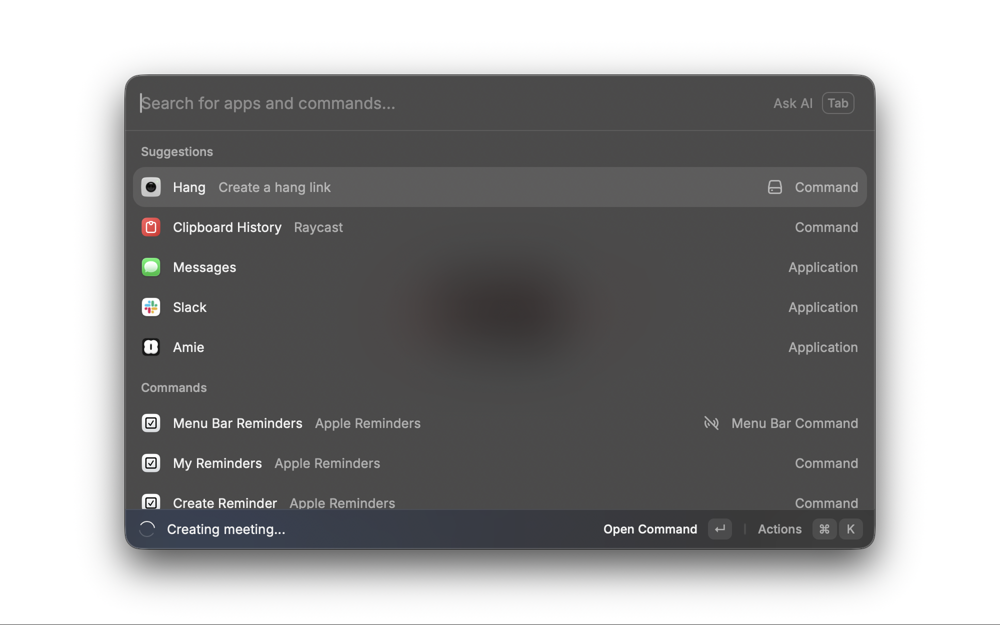

# 🤙 Hang — Quickly create meeting links



Quickly create meeting links (Google Meet or Zoom) from Raycast.

## Repository Structure

This is a monorepo containing:

- **`hang-extension/`** - Raycast extension (public client, no secrets)
- **`hang-backend/`** - Backend API service (handles OAuth securely)

## Architecture

The extension uses a secure backend architecture:

```
Extension (hang-extension) → Backend API (hang-backend) → Google Calendar API
```

- **Extension**: Public client, no secrets stored in code
- **Backend**: Owns OAuth credentials, handles token exchange securely
- **User Tokens**: Stored securely in Cloudflare KV

## Quick Start

### Extension

See [`hang-extension/README.md`](./hang-extension/README.md) for extension setup and usage.

### Backend

See [`hang-backend/README.md`](./hang-backend/README.md) for backend deployment instructions.

## Development

### Extension Development

```bash
cd hang-extension
npm install
npm run dev
```

### Backend Development

```bash
cd hang-backend
npm install
npm run dev
```

## Security

✅ **No secrets in extension code** - All OAuth credentials are stored server-side  
✅ **Secure token storage** - User tokens encrypted in Cloudflare KV  
✅ **Proper OAuth flow** - PKCE with backend token exchange  
✅ **Token expiration** - Extension tokens expire after 7 days  

## License

MIT
